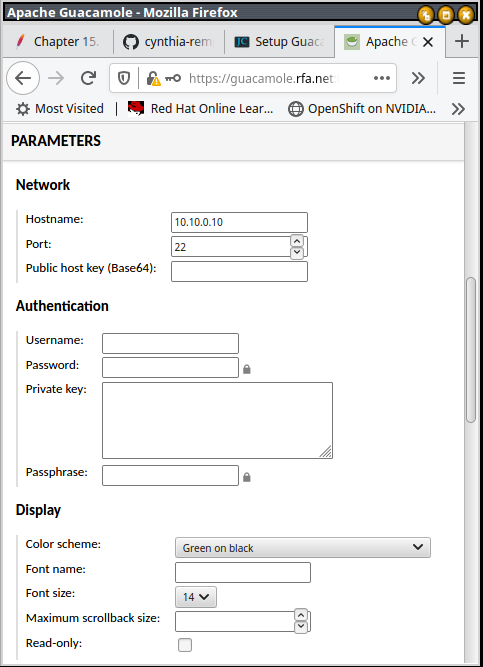

# Administration of Guacamole and Keycloak

You have now to manage 3 ressources :
- connections to VMs or servers,
  - they can be hierarchically organized with connection groups.
- user's that can access the servie,
- roles that defines authorizations.

There is 3 ways to manage thoses ressources :
1. using terraform : i encourage it as it will help to manage the lifecycles
2. using CLI Scripts located in `manage` directory
3. using the admin web GUI

## Manage Guacamole configuration with Terraform (**recommended**)

With terraform, in `./config/guacamole/guacamole-groups-and-connections` directory :
- edit `connection_groups.tf`, `connections.tf` and `user_groups.tf` to fit your needs
- run `./1.manage-guacamole-config.sh`

> Note :  for a fine grained RBAC, I recommended one connection group per project or team, and one user_group per connection

## Manage Guacamole configuration with CLI

*TODO*

## Manage Guacamole with web admin GUI  

### : Add Connections to a new VM/Server

A connection is an access to a VM or a server.

They can be hierarchically stored with connection groups

| Action description                          | CLI or screenshot |
| ------------------------------------------- | ----------------- |
| login to guacamole with an admin account    |  `firefox https://${GUAC_HOSTNAME}:8443/guacamole/`  |
| **Upper right corner, username, settings**  |   |
| **Middle top, connections, left, new connection**  |   |
| **Configure the SSH connection**            |   |
| *Name*: some-name                           | |
| *Location*: the connection group            | |
| *Protocol*: *SSH*                           | |
| *Max number of connections*: 2              | |
| *Max number of connections per user*: 2     | |
| **Scroll Down**, under the Network Section set the host |   |
| *Hostname*: set IP or FQDN                  | |
| *Port*: usually 22 for SSH, 3389 for RDP    | |
| *Username*: (optional) login (OS account)   | |
| *Password*: (optional) password (strong)    | |
| *Private Key*: (optional) SSH private key (public key must be declared `in $HOME/.ssh.authorized_keys`)    | |
| Click **SAVE** button                       | |

> Note : with MFA activated, setting a username and generate a strong Password (that is not given to the end user) could be considered.

Reference: https://jasoncoltrin.com/2017/10/04/setup-guacamole-remote-desktop-gateway-on-ubuntu-with-one-script/

### Adding User group to Guacamole (for RBAC)

User Groups define the authorizations of end users : which connections and connexion groups a user can access.

| Action description                          | CLI or screenshot |
| ------------------------------------------- | ----------------- |
| login to guacamole with an admin account    |  `firefox https://${GUAC_HOSTNAME}:8443/guacamole/`  |
| **Upper right corner, username, settings**  |   |
| **Middle top, Groups, left, new group**     |   |
| *Group Name*: some-name (i like to identify the project or team, and the VM)  | |
| *Connexions*: select the connexion the end user can view and use.  | |

## Manage Keycloak configuration with Terraform (**recommended**)

in `config/keycloak/guacamole-realm-config` directory :
  - edit `roles.tf` and `users.tf` to fit your needs
  - execute `config/keycloak/1.init-keycloak-realm.sh`

## Managing Keycloak : Add guacamole client roles to Keycloak

You have 3 differents ways to manage guacamole client roles to Keycloak :

1. (Recommended) With terraform in `config/keycloak/guacamole-realm-config/roles.tf`
2. With CLI :
    ```bash
    cd manage
    ./keycloak-add-gucamole-role.sh guacamoleUserGroupName "descirption of the role"
    ```
3. With Web admin GUI :
  - login on Keycloak admin : `source .secrets.env ; firefox https://${KC_HOSTNAME}:8443/admin/`
  - go to guacamole realm > clients > guacamole
    
  - open **Roles** tab, and click on **Create Role**
    
  - choose a role name, set a description and click **Save**

> the keycloak client role *guacamoleUserGroupName* must exactly match a guacamole user group

## Managing Keycloak : Adding users and roles to Keycloak

You have 3 differents ways to manage Keycloak users and roles :

1. (Recommended) With terraform in `config/keycloak/guacamole-realm-config/users.tf`
2. With CLI :
    ```bash
    cd manage
    ./keycloak-add-user.sh username email@fqdn
    ```
    > You will be prompted to add roles to the user
3. With Web admin GUI :
   - login on Keycloak admin : `source .secrets.env ; firefox https://${KC_HOSTNAME}:8443/admin/`
   - go to guacamole realm > **Users** > click **Add user**
   - set at least a username and a mail
   - set **Configure OTP** as a required action if an OTP is required for this user
   - (not needed with X.509 MFA) go to **Credentials** tab > click **Set password** > define a password.
     - prefer a temporary as the user will need to change it on first connexion
   - go to **Role mapping** tab > click **Assign Role** > select **Filter by clients** > enter $ in Search by role name
     - select the desired role(s) and click **Assign**

> If you activate MFA, Keycloak user's email should match the email embedded in SAN extention of end user's X.509 certificates.

## Keycloak security features

Keycloak propose a lot of very interesting security features : i selected my *best-of* below.

### Use LDAP or Kerberos user repository

Generally, using a managed user repository is far better than managing "local" Keycloak user accounts lifecycle.

Please read [Using external storage](https://www.keycloak.org/docs/latest/server_admin/#_user-storage-federation)

### Mitigating Security Threats

Have a look at this [article](https://www.keycloak.org/docs/latest/server_admin/#mitigating-security-threats).

I like the [brute force protection](https://www.keycloak.org/docs/latest/server_admin/#password-guess-brute-force-attacks) provided by Keycloak

### Using OTP

Have a look at this [article](https://www.keycloak.org/docs/latest/server_admin/#one-time-password-otp-policies)

End users need a smartphone with FreeOTP or Google Authenticator application installed.
It is very easy to configure.

to enforce users using OTP :
1. for all users : do this before creating users accounts
  - login on Keycloak admin : `source .secrets.env ; firefox https://${KC_HOSTNAME}:8443/admin/`
  - select **guacamole** realm (Upper left) > **Authentication** on the left menu > **Required actions** tab
  - on **Configure OTP** raw, **set as default action** true
      
2. for some users :
  - login on Keycloak admin : `source .secrets.env ; firefox https://${KC_HOSTNAME}:8443/admin/`
  - select **guacamole** realm (Upper left) > **Users** on the left menu > select the desired user
  - on **required user actions** field, select **Configure OTP**, click **Save**
     

### Self Service account managment

Keycloak provide a web interface for users, where they can :
- configure their profiles,
- change their passwords,
- add two-factor authentication,
- include identity provider accounts,
- ...

To retrieve the URL of the this service:
```bash
source .secrets.env
echo https://${KC_HOSTNAME}/realms/${KEYCLOAK_REALM_NAME}/account/
```

### [Optional] Add social login

You can activate social logins with bitbucket, Facebook, GitHub, GitLab, Google, LinkedIn, Twitter, ...

Simply follow the configurations steps in [Keycloak documentation](https://www.keycloak.org/docs/latest/server_admin/#social-identity-providers)

## Tips & tricks

### connecting to guacamole postgresql database

```bash
source .secrets.env
docker exec -it guacamole_database psql -U ${GUAC_POSTGRES_USER} -w guacamole_db
```
