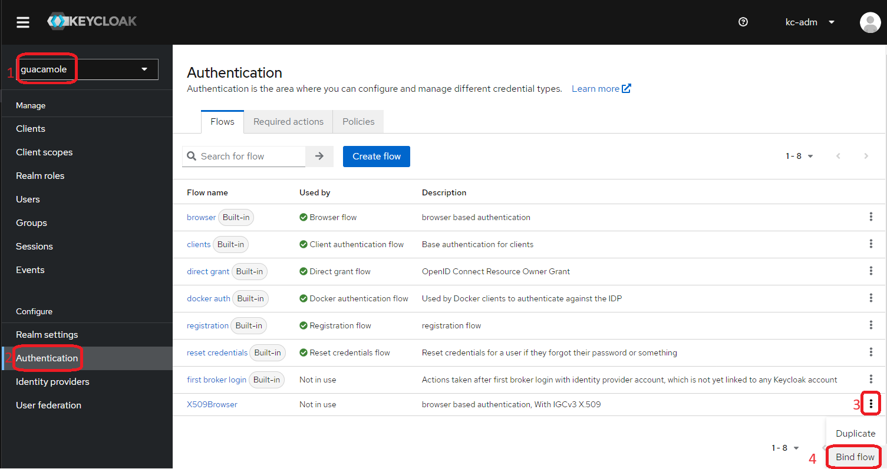

# Abstract

Docker compose project with [guacamole](https://guacamole.apache.org/) VDI services, relying on [Keycloak](https://www.keycloak.org/) for authentication and role based access control (RBAC).

The strenght of two great open source software combined :
- Guacamole :
  - only needs an HTML 5 Browser to access remote console or desktop on end users device,
  - only need 1 CPU with 2GB RAM per 25 connected users
  - is very reactive (if proxies doesn't blocks websockets...)
- Keycloak provides a lot of very nice security features.

Ready in 10 minutes, with MFA available in option :)

Configuration of [Guacamole](./config/guacamole/guacamole-groups-and-connections/) and [Keycloak](./config/keycloak/) can be managed as code with terraform, which improve configuration managment and auditability.

# Configuration

## Generate `.env` file with your secrets

Create `.env` file in project root directory, and edit it with you own needs (DNS, admin users, ...) :

```bash
source .secrets.env
vi .env
```

> Note : as this file contains randomly generated secrets, please store a copy in your favorite safe software :lock: (I personally use [keepassXC](https://keepassxc.org/)).

> Note : these environment variables could be used in CI/CD jobs, that could execute terraform configuration changes on merge request :+1:

## TLS X.509 server certificates

> Note : haproxy sni requires *uniq* X.509 server certificates for *each* backend, so you'll need separate certificates for guacamole and keycloak.

You have 3 options, choose one of them :

1. **Generate self signed server certificates** : fast but dirty (on a security point of view **and** end user's experience)
   - set `TLS_LETS_ENCRYPT=false` in `.env` file
   - Please add init/guacamole.crt and init/keycloak.crt to your browser's trusted certificates after generation (`./setup.sh` execution) to avoid browser security warnings.

2. **Use free server certificates** : you need a public IP linked to DNS A records for `.env->GUAC_HOSTNAME` and `.env->KC_HOSTNAME`
   - set `TLS_LETS_ENCRYPT=true` in `.env` file
   - TLS keypair and certificates will be generated automatically with [acme.sh](https://github.com/acmesh-official/acme.sh/wiki/Run-acme.sh-in-docker)

3. **Use server certificates** delivred by your internal PKI/CA
   - set `TLS_LETS_ENCRYPT=false` in `.env` file
   - provide 4 files in PEM/Base64 format :
     - `init/guacamole.crt`
     - `init/guacamole.key`
     - `init/keycloak.crt`
     - `init/keycloak.key`

## (Optional) Adding CA for TLS X.509 client authentication

Add your own CA that issue end user authentication certificates to `myCompanyCA.pem` file, in PEM format (base64 encoded).

## DNS records

As it is a web service, it requires name resolution : please register two DNS records for keycloak and guacamole.

> for a local POC, add the following line to `/etc/hosts` if you didn't register DNS records :
> ```bash
> source .secrets.env
> echo "127.0.1.1 ${GUAC_HOSTNAME} ${KC_HOSTNAME}" >>/etc/hosts
> ```

## Generating pre-run configuration

The `setup.sh` script will configure the databases and cryptographic files : keypairs, certificates and truststure 

```bash
./setup.sh
```

> Note : init, data and openid directories will be created

# Start the service

```bash
docker compose up -d
```

Two final steps are required to finalize the configuration.

## Finalize keycloak configuration

Terraform is used to :
1. create a new realm
2. create the guacamole client role for passing RBAC guacamole client roles to guacamole webapp 
3. create the guacadmin user and password on Keycloak  

```bash
cd config/keycloak
./1.init-keycloak-realm.sh
```

> Note : you can add [users](./config/keycloak/guacamole-realm-config/users.tf) and [roles](./config/keycloak/guacamole-realm-config/roles.tf)

## Finalize guacamole configuration

```bash
cd config/guacamole
./1.manage-guacamole-config.sh
```

> Note : you will be prompt to manually authenticate on guacamole with your web browser, then copy/paste the guacamole authentication token (Guacamole-Token HTTP Header) in the console

> Note : you can add [user groups](./config/guacamole/guacamole-groups-and-connections/user_groups.tf), [connection groups](config/guacamole/guacamole-groups-and-connections/connection_groups.tf) and [connections](config/guacamole/guacamole-groups-and-connections/connections.tf)

## (Optional) Activation of MFA with X.509 client certificate

In Keycloak admin GUI, change the Browser flow to `X509Browser` as default :

0. `firefox https://${KC_HOSTNAME}:8443/admin/`
1. On the left menu, select **guacamole realm**
2. select **Authentication** 
3. on the right, on **`X509Browser`** raw, click on **...** and select bind flow
4. choose binding type : **Browser flow**, click save



You can also manage it with terraform : 
2. define a new guacamole admin user, as the default one (guacadmin@guacadmin) won't be able to login anymore
  - `firefox https://${KC_HOSTNAME}:8443/admin/` > select guacamole realm > select Users > choose a user
  - on **Role mapping** tab, click **Assign role** > Filter by clients > put in search *guacamole* > select **Guacamole-Admins** > click **Assign**
1. set `browser_flow` key to value **X509Browser**  ( simply switch comments @ line 46/47 in `./config/keycloak/guacamole-realm-config/main.tf`)

> Note : you can rollback by setting back the default `browser` authentication flow.

### end user's certificate mapping

Keycloak use an X.509 certificate information to link it to an existing keycloak user account.

By default, the provided mapping is based on the email address set in the SAN extention.

you can simply change it:
- Go to guacamole realm > Authentication > select X509Browser
- on X509/Validate Username Form raw > settings 
- check Keycloak documentation @ [X.509 client authentication](https://www.keycloak.org/docs/latest/server_admin/#_x509) chapter

> 
 
## Use the service

Open your favorite HTML 5 compliant browser (firefox, chrome, chromium, edge, ...) :

### Guacamole service

```bash
source .secrets.env
firefox https://${GUAC_HOSTNAME}:8443/guacamole/
```

  - authenticate with guacadmin@guacadmin / guacAdmin@guacAdmin
  - you will be prompted to change the password on first login
    - please store it in your favorite safe software.

### Keycloak service

```bash
source .secrets.env
firefox https://${KC_HOSTNAME}:8443/admin/
```

  - authenticate with `KEYCLOAK_ADMIN_USER` / `KEYCLOAK_ADMIN_PASSWORD` from `.env` file

> End users **MUST** read the documentation before using the service : https://guacamole.apache.org/doc/gug/using-guacamole.html

## VDI service administration

Now that you have Guacamole running, you may want to [manage users, roles and connections](./Admin-guide.md)

## Uninstall

```
docker-compose down
./teardown.sh
```

## Features (added by Arnault MICHEL)

first, i would like to say thanks to [cynthia-rempel](https://github.com/cynthia-rempel) who initiate the work.

I bring it one step weyong with :
 - [x] use latest (@ Sept 2023) versions of guacamole and keycloak softwares
 - [x] generate automatically free TLS server certificates (need public IP & DNS )
 - [x] use a dedicated keycloak realm for guacamole ([master realm](https://www.keycloak.org/docs/latest/server_admin/#the-master-realm) is [special](https://www.keycloak.org/docs/latest/server_admin/#master-realm-access-control), it should only be used for **admin purpose only**)
 - [x] add a dedicated client scope to transfer client roles in a OIDC CLAIM named [`groups`](https://guacamole.apache.org/doc/gug/openid-auth.html#configuring-guacamole-for-single-sign-on-with-openid-connect) 
 - [x] add CLI scripts to manage keycloak users and roles
 - [x] configure guacamole admin user
 - [x] manage guacamole groups and connections with terraform
 - [~] add CLI scripts to manage manage guacamole groups and connections
   - ask for a token after a manual authentication, then call rest API's with curl 
 - [ ] remove `/guacamole` URI
 - [ ] manage default guacamole admin user with environment variables
 - [ ] manage automatic TLS server certificate renewal with acme.sh
 - [ ] provide another terraform subproject for adding guacamole client to an existing Keycloak REALM

## References

  - [Keycloak documentation](https://www.keycloak.org/docs/)
  - [Guacamole documentation](https://guacamole.apache.org/doc/gug/)
  - https://github.com/airaketa/guacamole-docker-compose/tree/5aac1dccbd7b89b54330155270a4684829de1442
  - https://lemonldap-ng.org/documentation/latest/applications/guacamole
  - https://guacamole.apache.org/doc/gug/administration.html#connection-management
  - https://jasoncoltrin.com/2017/10/04/setup-guacamole-remote-desktop-gateway-on-ubuntu-with-one-script/
