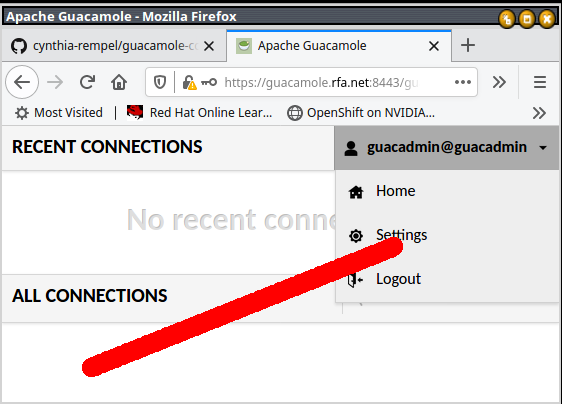
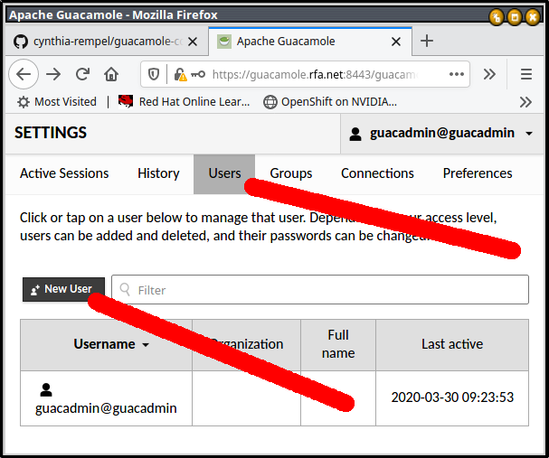
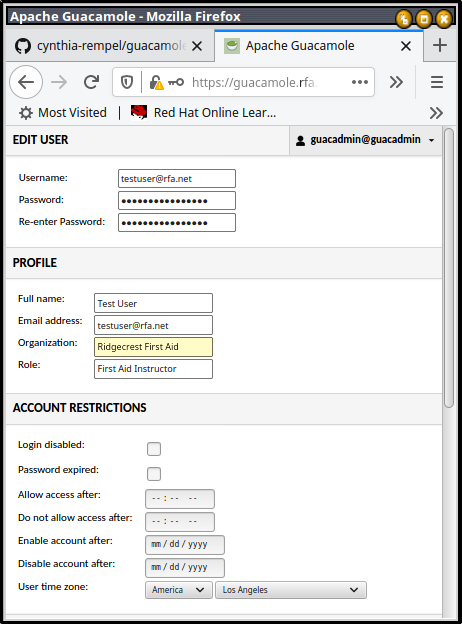
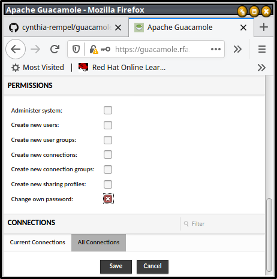
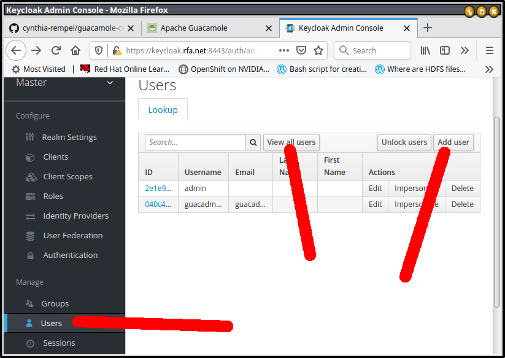
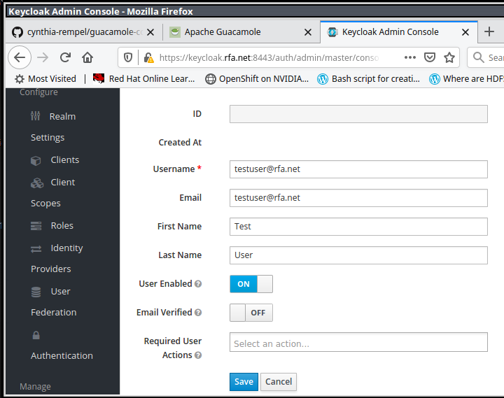
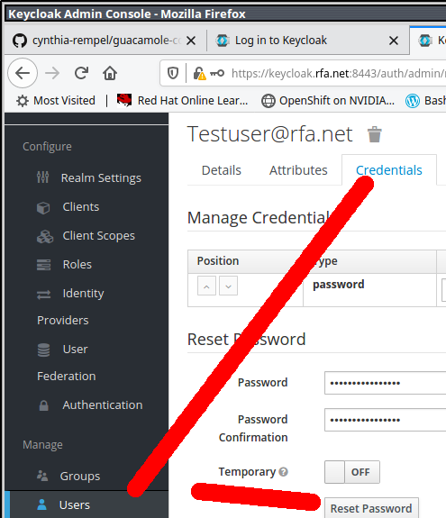
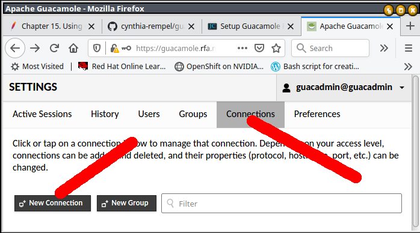
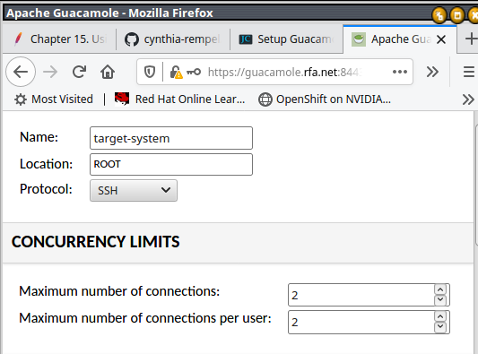
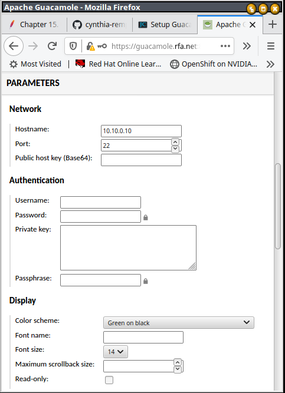

# guacamole-compose

Docker compose project with keycloak and guacamole

## Configuration file

Create `.env` file in project root directory, and set you own env var :

> not needed for a POC

```bash
#set your custom FQDN for guacamole service
GUAC_HOSTNAME=guacamole.mydomain
GUAC_POSTGRES_PASSWORD=**strong-random-password**

KEYCLOAK_VERSION=22.0.1
GUACAMOLE_VERSION=1.5.3

KEYCLOAK_ADMIN_USER=kc-admin
KEYCLOAK_ADMIN_PASSWORD=**strong-random-password**

#set your custom FQDN for keycloak authentication service
KC_HOSTNAME=keycloak.mydomain
KC_POSTGRES_PASSWORD=**strong-random-password**

# generate free TLS server certificate if the service is exposed on Internet
TLS_USE_LETS_ENCRYPT_CERTS=true
ACME_ACCOUNT_EMAIL=arnault.michel.external@banque-france.fr

HA_PROXY_ENDPOINT=guacamole.poc.eclair.cloud
```

## TLS server certificates

**Please note:**  haproxy sni requires *uniq* certs for *each* backend so
you'll need separate certs for guacamole and keycloak

You have 3 options :

- **generate self signed server certificates** : fast but dirty

- **use free server certificates** if you have create DNS records for  GUAC_HOSTNAME and KC_HOSTNAME

- **generate server certificates** with your internal ca


## To get started with no configurations, run 

```
./setup.sh

docker-compose up
```

> Requires name resolution to work, so added the following entry to `/etc/hosts` if you didn't register DNS entries:

```
source .secret.env
echo "127.0.1.1 ${GUAC_HOSTNAME} ${KC_HOSTNAME}" >>/etc/hosts
```

### Trust the certs

Please add init/guacamole.crt and init/keycloak.crt to your trusted certificates.

### Configure keycloak : Create the guacadmin user and guacamole  

```bash

cd config/keycloak

./init-keycloak.sh
```

### TODO: manage 


## TODO

 - [ ] use a dedicated keycloak realm for guacamole
 - [ ] add a dedicated client scope to transfer client roles in a OIDC CLAIM named [`groups`](https://guacamole.apache.org/doc/gug/openid-auth.html#configuring-guacamole-for-single-sign-on-with-openid-connect) 
 - [ ] set scripts to manage users (on keycloak), connexions and groups


## To use

Then browsed to:

https://${GUAC_HOSTNAME}:8443/guacamole

https://${KC_HOSTNAME}:8443

### To add users

---

Guacamole uses keycloak for identity, and uses postgres for authorization.

```
Guacamole's OpenID Connect ... removing the need for users to log into Guacamole
directly. This module must be layered on top of ... that provide connection
information ... database authentication ....
```

Because of this, ***users have to be added to both keycloak and postgres.***

Reference: https://guacamole.apache.org/doc/gug/openid-auth.html

---

#### Adding a user to Postgres

To add users to postgres, add them through the guacamole application.

https://${GUAC_HOSTNAME}:8443/guacamole

username: *guacadmin@guacadmin*

password: *guacadmin*

---

**Upper right corner, username, settings**



---

**Middle top, users, left middle, new user**



---

**Make sure the username is in email format, make appropriate selections**



---

**Scroll down, continuing to make appropriate selections, then click save**



***NOTE***: if a connection is under a subgroup, both the subgroup and
connection must be checked for the user to create a connection.

---

#### Adding user to Keycloak

https://${KC_HOSTNAME}:8443

Administration Consolehttps://maas.io/docs

---

**Scroll down, click users, view all users, add user**



---

**Make the keycloak user's email match the username and email of guacamole user**



***NOTE***: The email of the keycloak user must match the username and email of the guacamole user.

---

**Set the password**



*Why doesn't keycloak let you set the password when you create the user ?!?*

---

## Adding Connections

---

**Upper right corner, username, settings**


---

**Middle top, connections, left, new connection**



---

**Make an SSH connection**

- *Name*: some-name

- *Location*: the-group

- *Protocol*: *SSH*

- *Max number of connections*: 2

- *Max number of connections per user*: 2

Reference: https://jasoncoltrin.com/2017/10/04/setup-guacamole-remote-desktop-gateway-on-ubuntu-with-one-script/



---

**Set the host**

**Scroll Down**, under the Network Section set the host



**CLICK SAVE **
---

## Where to send users when you want to tell them RTFM

https://guacamole.apache.org/doc/gug/using-guacamole.html

## To uninstall

```
docker-compose down
./teardown.sh
```

## Reference:

  - https://github.com/airaketa/guacamole-docker-compose/tree/5aac1dccbd7b89b54330155270a4684829de1442
  - https://lemonldap-ng.org/documentation/latest/applications/guacamole
https://guacamole.apache.org/doc/gug/administration.html#connection-management
  - https://jasoncoltrin.com/2017/10/04/setup-guacamole-remote-desktop-gateway-on-ubuntu-with-one-script/
